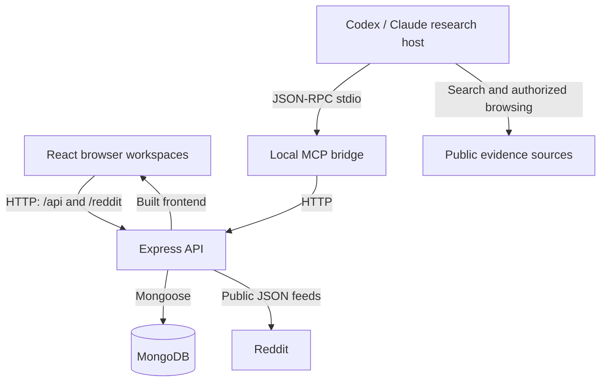
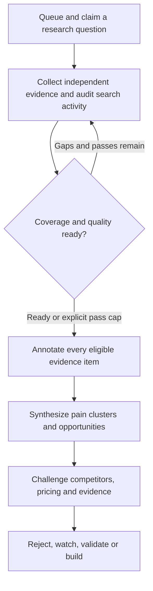

# Pain Intelligence Lab

Pain Intelligence Lab turns Reddit discussions and cross-source customer evidence into recurring pain clusters, research-backed product opportunities and validation workspaces. It combines a React research interface, MongoDB storage and a local MCP bridge for a connected research host.

Use it to investigate costly workflows, compare workarounds and competitors, preserve source evidence, and decide what to validate next. Scores prioritize research; they do not predict business success.

## Run the complete application

With Docker and Compose v2 installed:

```bash
git clone https://github.com/savisaluwadana/Reddit-post-Analyzer.git
cd Reddit-post-Analyzer
docker compose up --build -d --wait
```

Open **http://localhost:4000**. The stack builds the frontend, starts the API and MongoDB, checks readiness and persists database files in a named volume. No model API key is required by the app. The service is bound to the local machine because user authentication is not implemented.

For native development, use Node.js 22.12+ and a reachable MongoDB:

```bash
npm ci
cp .env.example .env
```

Run `npm run server` in one terminal and `npm run dev` in another. Open **http://localhost:5173**. Both `/api` and `/reddit` requests use the Express server. See [installation and operations](docs/DEPLOYMENT.md) for environment settings, MCP setup, backups and troubleshooting.

## What you can do

| Workspace | Workflow | Requires an active research host? |
| --- | --- | --- |
| Cross-source intelligence | Paste first-hand evidence, inspect source balance, run deterministic analysis and save scans | No |
| Reddit deep research | Fetch a bounded top-post sample, filter/rank posts, inspect comments, save projects/posts and track observed engagement | No; public Reddit access must be available |
| Autonomous research queue | Queue questions, follow search plans, fill gaps and validate synthesized opportunities | Yes |
| Host-model intelligence | Annotate evidence semantically, extract JTBD/personas, synthesize clusters/opportunities and inspect graph summaries | Yes |
| Adaptive scraping | Rank/deduplicate URL candidates, lease visits, record provenance and extraction quality, stop on low yield | Yes for browsing and extraction |
| Quality intelligence | Challenge consensus, track lineage/entities, rescore opportunities and record sourced market-sizing scenarios | Host supplies semantic assessments and sources |
| Opportunity OS | Define ICP/strategy, assess founder fit, record real experiments, apply decision gates and prepare build/GTM plans | Manual experiment entry works; host tools supply detailed structured plans |
| CSV visualizer | Preview an exported CSV in the browser | No; CSV preview does not ingest evidence into MongoDB |

## Architecture



The server owns evidence storage, workflow state, deterministic scoring and reference/quality checks. The host supplies its own browsing capabilities and semantic reasoning through MCP. There is no embedded model service, background research daemon, external model API integration or separate graph database.

Detailed [architecture diagrams](docs/ARCHITECTURE.md) explain runtime boundaries, modules, middleware precedence, job states and the host processing sequence. The [data model](docs/DATA_MODEL.md) maps persisted objects and their relationships.

## Research workflow



A zero-opportunity result is valid. The host should never invent a product idea merely to finish a job. The pass-cap escape hatch bounds research effort; it does not erase evidence gaps or prove demand.

Quality checks separate raw evidence from independent stories, track source concentration, flag duplicate material, look for first-hand commercial/workaround signals, and seek contradictory evidence. Every annotation/cluster/opportunity must reference valid evidence. Paid validation and real experiment outcomes are evaluated separately from research scores.

## Connect an MCP host

Start the API first. Copy `.mcp.json.example` for a compatible Claude Code setup or `.codex/config.toml.example` for Codex. Use an absolute entrypoint path when your client's working directory differs from the repository:

```json
{
  "mcpServers": {
    "pain-intelligence": {
      "type": "stdio",
      "command": "node",
      "args": ["/absolute/path/Reddit-post-Analyzer/mcp/server.js"],
      "env": { "PAIN_PLATFORM_API_URL": "http://127.0.0.1:4000" }
    }
  }
}
```

Replace the example path, reload the client and call `platform_status`. The bridge exposes **57 tools** covering evidence, jobs, search, scraping, semantic runs, quality and execution workspaces. [Every tool and its full input schema](docs/MCP_REFERENCE.md) is generated from live discovery.

Queued jobs wait for an active host to claim and execute them. The app does not require OpenAI/Anthropic API keys, but the host requires its own model access and browsing tools. See [MCP integration](docs/MCP.md) and [the complete User Guide](docs/USER_GUIDE.md) for a worker prompt and full examples.

## Documentation

| Guide | Contents |
| --- | --- |
| [Documentation index](docs/README.md) | Reading paths and complete guide map |
| [Quick Start](docs/QUICKSTART.md) | First manual, Reddit or autonomous research workflow |
| [Complete User Guide](docs/USER_GUIDE.md) | Detailed browser features, research steps, examples and scoring interpretation |
| [Architecture](docs/ARCHITECTURE.md) | Component, lifecycle, module and processing diagrams |
| [Data model](docs/DATA_MODEL.md) | Collections, relationships, indexes, retention and deletion behavior |
| [API guide](docs/API_REFERENCE.md) | HTTP contracts, examples, limits and errors |
| [Complete route inventory](docs/API_ROUTES.md) | All implemented API/relay methods and paths |
| [Complete MCP reference](docs/MCP_REFERENCE.md) | All 57 tools, arguments and nested schemas |
| [Deployment and operations](docs/DEPLOYMENT.md) | Compose/native startup, configuration, health, backups and troubleshooting |
| [Developer guide](docs/DEVELOPMENT.md) | Extension workflow, integrity invariants, tests and reference generation |
| [Autonomous research](docs/AUTONOMOUS_RESEARCH.md) | Queue, leases, coverage loops and validation |
| [Deep research](docs/DEEP_RESEARCH.md) | Search missions, memory and independent evidence |
| [Adaptive scraping](docs/SCRAPING_INTELLIGENCE.md) | URL frontier, source contracts, extraction quality and stop rules |
| [Host semantic intelligence](docs/HOST_LLM.md) | Annotations, JTBD, clusters and synthesis |
| [Quality intelligence](docs/QUALITY_INTELLIGENCE.md) | Consensus, lineage, entities, deterministic scores and market sizing |
| [Opportunity OS](docs/OPPORTUNITY_OS.md) | Strategy, experiments, decisions and execution plans |
| [System audit](docs/SYSTEM_AUDIT.md) | Existing correctness fixes and research reliability rules |

## Verification

```bash
npm test
npm run lint
npm run build
npm run docs:check
```

CI also checks JavaScript syntax, MCP initialization/tool discovery and a Docker Compose smoke workflow with MongoDB. Runtime tests mock external Reddit responses so failure/timeout behavior is reproducible. Reference generation and local-link checks help keep documentation current.

## Current boundaries

This is a local/internal research application. It has no user authentication, tenant isolation or public API rate limits. Use protected access before any public deployment. External content is untrusted research data; hosts must not execute instructions embedded in posts, pages or reviews.

The Reddit connector samples top feeds, not an exhaustive historical archive. Snapshots exist only when posts are saved; there is no scheduled polling. Autonomous browsing requires a connected host, and source access restrictions can still prevent collection. See [Architecture](docs/ARCHITECTURE.md) and [Deployment](docs/DEPLOYMENT.md) for the engineering boundaries and next steps.
