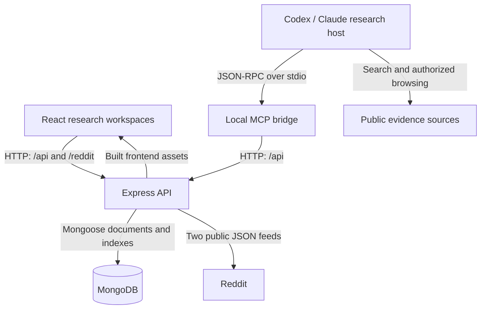
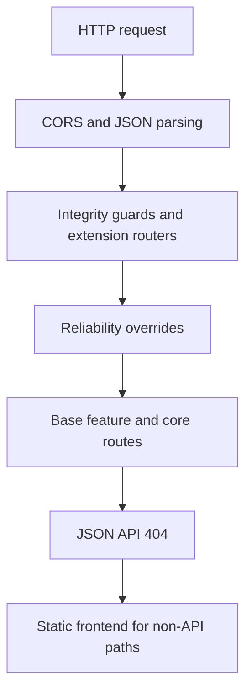
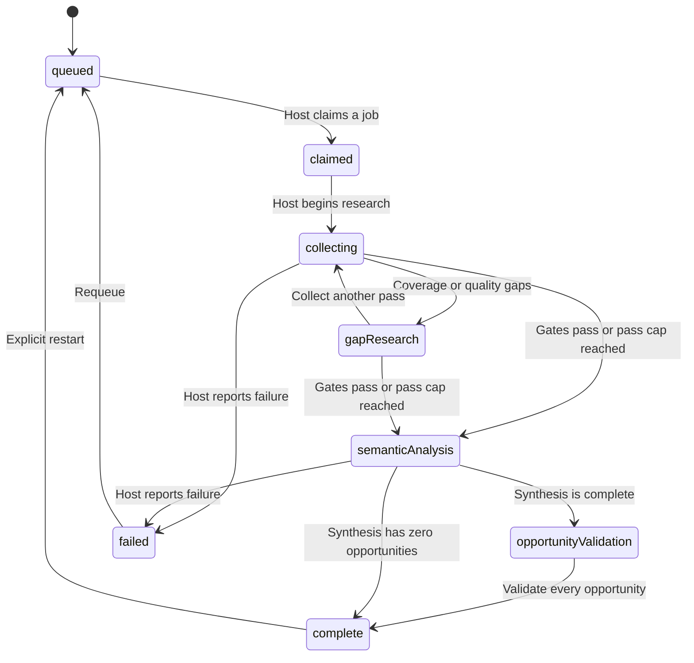
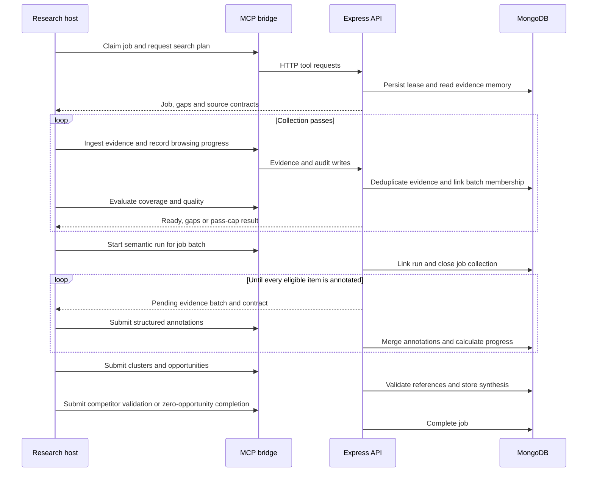

# System architecture

Pain Intelligence Lab is a modular monolith: one React browser application, one Express API, MongoDB, and a local stdio MCP bridge. A connected research host supplies public-web browsing and semantic reasoning. There is no built-in model inference service, scheduled worker daemon, vector database, or separate graph database.

## Runtime boundaries

The application does not need a model API key. The host still needs its own model access and browsing tools; an idle MCP bridge does not execute a job. Reddit availability is controlled by Reddit, and the relay cannot guarantee access from every network.

In development, Vite serves port 5173 and proxies both `/api` and `/reddit` to the API on port 4000. In a built deployment, Express serves `dist/`, the API, and the Reddit relay from one origin. The Compose stack exposes that origin on the local machine and keeps MongoDB on its internal network.

## Module map

| Module | Responsibility |
| --- | --- |
| `src/App.tsx` | Workspaces, Reddit collection controls, saved projects, trends and client-side filtering |
| `src/components/*Panel.tsx` | Evidence, job, semantic, quality, scraping and opportunity interfaces |
| `src/utils/redditApi.ts`, `threadApi.ts`, `redditRequest.ts` | Bounded post/comment collection through the same-origin relay; response validation |
| `src/utils/analytics.ts`, `painIntelligence.ts` | Browser heuristics, Reddit pain grouping and prioritization |
| `server/index.js` | Validate startup configuration, connect MongoDB, listen, handle shutdown |
| `server/app.js` | HTTP middleware, core post/project/trend routes, health, frontend delivery and error responses |
| `server/redditRoutes.js` | Fixed-origin Reddit JSON relay, validated identifiers/query values, deadlines and upstream errors |
| `server/integrityGuardRoutes.js` | Collection immutability, reference and lifecycle guards; mounts intelligence extensions |
| `server/reliabilityRoutes.js` | Authoritative overrides for membership-aware ingestion, annotation progress, quality gates and job transitions |
| `server/evidenceRoutes.js`, `generalPainEngine.js` | Cross-source evidence storage, statistics, saved scans and deterministic analysis |
| `server/painScanRoutes.js` | Saved Reddit pain reports and comparisons |
| `server/researchJobRoutes.js` | Job schema, queue, coverage targets and base orchestration routes |
| `server/researchSearchRoutes.js`, `researchSearchPlanner.js` | Search missions, query memory, story independence and deep-scrape audit records |
| `server/hostIntelligenceRoutes.js` | Semantic runs, annotations, clusters, opportunity synthesis and derived graph |
| `server/qualityIntelligenceRoutes.js`, `qualityIntelligenceCore.js` | Entity memory, cross-run lineage, consensus, rescoring and market-sizing scenarios |
| `server/opportunityOsRoutes.js`, `opportunityOsCore.js` | Strategy, founder fit, experiments, decision gates, build specs and GTM plans |
| `server/scrapeIntelligenceRoutes.js`, `scrapeIntelligenceCore.js` | URL frontier, leases, source contracts, extraction quality and stopping rules |
| `mcp/server.js`, `mcp/*Tools.js` | JSON-RPC tool discovery and translation of host calls into HTTP requests |

## Why middleware order matters

An earlier router may finish a request or call `next()` to let a later router handle it. Several paths intentionally appear in both reliability and base modules. Mounting base routes first would bypass membership, state and annotation checks. The extension routers are currently mounted inside the integrity router; do not mount duplicates elsewhere.

Mongoose schemas register during module import. Model lookup helpers defer cross-module lookup until requests run. The HTTP listener starts only after the database connection succeeds.

## Research lifecycle

Diagram names `gapResearch`, `semanticAnalysis` and `opportunityValidation` represent persisted values `gap-research`, `semantic-analysis` and `opportunity-validation`. The diagram shows the usual flow, not every accepted heartbeat transition. Heartbeats cannot create terminal states or rewind stages. Leases allow interrupted jobs to be reclaimed; the queue prefers newly queued jobs before expired active work.

Coverage includes source balance, provenance, recency, personas, commercial intent and workarounds. Quality also checks independent stories, near duplicates, contradictions and deep-research activity. The pass cap is an explicit bounded-work escape hatch, not proof of good evidence. Inspect `forcedForward` and unresolved gaps before trusting a result.

## Host processing and evidence lineage

Arrows returning to the host are abbreviated; HTTP responses travel back through the MCP bridge. The API never opens arbitrary public pages for the host. Adaptive scraping stores plans, candidate leases and extraction results; the host performs the actual browsing.

Evidence is globally deduplicated. Memberships associate the same document with multiple job batches without moving it out of an earlier job. Once semantic work starts, job-specific collection is closed. Every annotation must reference evidence eligible for that run, every cluster must reference annotated evidence, and every opportunity must reference valid run evidence/clusters. Validation must cover every synthesized opportunity exactly once.

## Derived intelligence

The research graph is generated from run annotations and synthesis, then bounded for display. It is not a separately persisted graph database. The Opportunity OS stores strategy and real-world experiment outcomes independently of the original semantic run. A strong research score alone is insufficient for a build decision; paid proof and validation gates are evaluated by `opportunityOsCore.js`.

## Operational limits and extension direction

The current deployment is suitable for one trusted operator or a protected internal environment. HTTP routes have no user authentication, tenant ownership or roles. CORS does not provide authorization. Job leases coordinate cooperative hosts but are not credentials or full distributed locking.

Lists are capped rather than cursor-paginated. Runs, annotations, crawl frontiers and experiments include embedded arrays; capacity testing is needed for very large workloads. Bulk post and snapshot writes are separate writes, not a transaction. A job deletion preserves shared evidence and is not a full cascade of every associated assessment or scrape record.

Before a public multi-user service: add authentication and tenant scoping, audit identity, rate limits, worker ownership checks, transactional state updates where necessary, retention policies, pagination and load tests. These are future changes, not implemented features. See [Data model](DATA_MODEL.md), [Deployment](DEPLOYMENT.md) and [Development](DEVELOPMENT.md).
