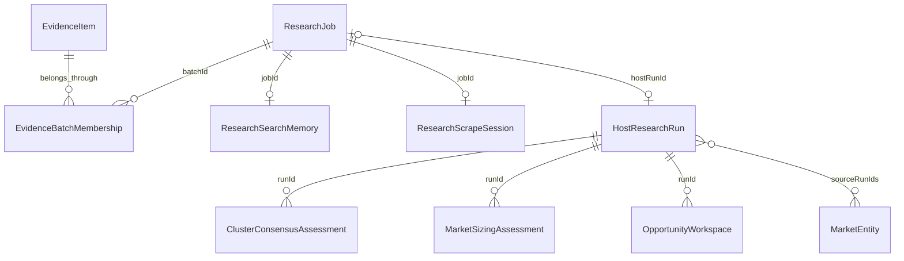

# Data model and storage

MongoDB is the durable store. Mongoose schemas define validation, indexes and embedded structures. ObjectIds serialize as strings in JSON; `createdUtc` is Unix seconds, while most stored timestamps are BSON dates returned as ISO strings. `capturedHour` is an integer UTC hour bucket.

## Evidence and research relationships

These are application relationships, not database-enforced foreign keys. A standalone host run need not have a job, and job restarts may leave historical runs. Run annotations, clusters and opportunities are embedded arrays whose IDs are meaningful within the run. Batch memberships use `batchId`, not a stored `ResearchJob` ObjectId.

## Collection catalog

| Mongoose model | Key data | Important indexes or constraints |
| --- | --- | --- |
| `RedditPost` | Latest post title/text, author, source URLs, engagement and fetch time | Unique `redditId`; subreddit/date; score/comments; text search on title and self text |
| `PostSnapshot` | Post engagement at an observed hour | Unique `(redditId, capturedHour)`; TTL on `capturedAt`; subreddit/capture time |
| `ResearchProject` | Reusable subreddit and keyword configuration | `updatedAt`; bounded name/description; enumerated signal and sort modes |
| `PainScan` | Saved Reddit pain report, clusters and counts | See `painScanRoutes.js`; snapshots of computed results, not live queries |
| `EvidenceItem` | Fingerprint, source type/name/URL, text, author, community, published date, metadata | Unique `fingerprint`; text search; source and date indexes |
| `EvidenceBatchMembership` | Evidence ObjectId, batch string, first/last association times | Unique `(batchId, evidenceId)` |
| `CrossSourceScan` | Saved deterministic report and filters | Created-time history; embeds report clusters/evidence summaries |
| `ResearchJob` | Topic, audience, status, priority, batch, lease, targets, coverage and validations | Unique `batchId`; queue index `(status, priority, createdAt)`; lease/updated-time indexes |
| `ResearchSearchMemory` | Query attempts, search missions, browsing activity and deep-scrape audit | Schema in `researchSearchRoutes.js`; belongs to a job |
| `HostResearchRun` | Topic/filter scope, annotations, clusters, opportunities, synthesis notes | Status/updated-time and created-time indexes; embedded semantic outputs |
| `ResearchScrapeSession` | Policy, candidates, pages, retry/lease timestamps and stop reason | Unique `jobId`; candidates/pages are embedded |
| `MarketEntity` | Canonical key/name, aliases, types and run mentions | Unique `canonicalKey`; source run references |
| `ClusterConsensusAssessment` | Support, contradiction, mixed and neutral evidence IDs | Unique `(runId, clusterId)` |
| `MarketSizingAssessment` | Population/spend/share ranges, sources, assumptions and calculations | Unique `(runId, opportunityId)` |
| `OpportunityWorkspace` | Run/opportunity link, strategy, founder fit, experiments, build spec, GTM and stage | See `opportunityOsRoutes.js`; linked execution workspace with embedded experiments |

Mongoose determines collection names; inspect `mongoose.models.<Model>.collection.name` when writing database tooling rather than assuming a custom name.

## Evidence identity

Ingestion normalizes snake_case and camelCase inputs, bounds text and computes a fingerprint. The fingerprint algorithm is in `normalizeEvidence` in `reliabilityRoutes.js`; it is the authoritative path for `/api/evidence/bulk`. Duplicate items within a request collapse before writing. A duplicate stored item updates mutable fields and `lastSeenAt` rather than inserting a second document.

Membership rows preserve many-to-many batch associations. Legacy `EvidenceItem.batchId` is retained for older data and remains readable. Changing fingerprint rules requires a migration plan: otherwise the same source can become duplicate stored evidence or unrelated content can be incorrectly merged.

`externalId` identifies a source item; Mongo `_id` identifies the stored document. Semantic annotations and cluster references use stored evidence IDs from the evidence-batch response. Do not substitute Reddit post IDs, URLs or fingerprints.

## Provenance and independence

For useful quality checks, supply source name/type, URL, author, community, publication date, and metadata such as `root_url`, `thread_id` or `conversation_id`. Twenty comments from one discussion can be twenty evidence items while still representing one independent story. Item count, story count and source diversity are separate metrics.

Ingested text may contain personal information or untrusted instructions. Keep only research-relevant material; source text must never become executable instructions for the host.

## Retention and observation semantics

`SNAPSHOT_RETENTION_DAYS` is bounded to 7–365 days, with default 90. Its TTL index expires engagement observations asynchronously. Latest posts, evidence, research runs, assessments and workspaces do not have a universal expiry policy.

Saving a post records an observation. There is no background Reddit polling. A second save within the same UTC hour updates that hour's snapshot; it does not create another independent sample. Daily trend averages/totals aggregate recorded snapshots and are not estimates of all subreddit activity or unique daily post totals.

MongoDB's existing TTL index options may need an explicit index update when retention changes; restarting alone should not be assumed to modify an existing TTL index. Back up the database and inspect `getIndexes()` before using an administrator's `collMod` operation.

## Deletion behavior

| Action | Behavior |
| --- | --- |
| Delete project or saved scan | Removes that saved object; does not delete collected posts/evidence |
| Delete research job | Removes the job, its memberships and search memory; preserves shared evidence; not a full cascade of scrape sessions, host runs or later assessments |
| Delete host run | Integrity guard prevents deletion while referenced by a research job; do not assume a full cascade of quality/execution records |
| Delete evidence item | Any membership or legacy batch association blocks direct deletion, even without an active job; this is not a general retention/erasure workflow |
| `docker compose down` | Stops containers and retains the named database volume |
| `docker compose down -v` | Deletes the Compose database volume and its data |

There is no tenant boundary, user-level ownership or soft-delete audit trail. Use a dedicated database for each isolated deployment. See [Deployment and backups](DEPLOYMENT.md).

## Schema changes

Schemas are registered by importing the server modules. Unique indexes protect identities, but application checks protect cross-document references and lifecycle rules. The API does not implement a general migration framework. For a schema/index change: back up, test with representative old documents, apply any data conversion deliberately, inspect indexes and verify a restore. Avoid `syncIndexes()` in a live deployment without reviewing index removals.
