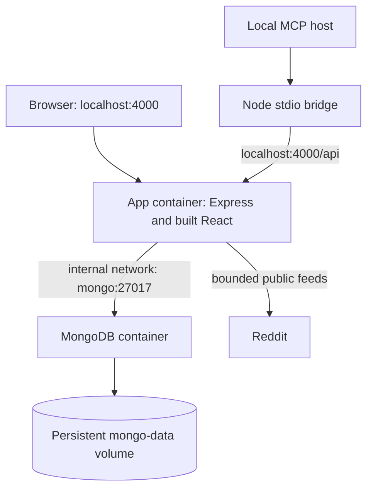

# Installation, deployment and operations

## Local application with Docker Compose

Install Docker with Compose v2, clone the repository, then run:

```bash
git clone https://github.com/savisaluwadana/Reddit-post-Analyzer.git
cd Reddit-post-Analyzer
docker compose up --build -d --wait
```

Open [http://localhost:4000](http://localhost:4000). This builds the React frontend, serves it from Express, waits for MongoDB health, and stores database files in a named volume. You do not need Node, a local MongoDB installation or a model API key for this browser workflow. Autonomous research also needs an active MCP host; see below.

The published port binds to `127.0.0.1`. MongoDB has no published host port. This is an intentional local deployment. The API has no authentication/tenant isolation. Do not change the binding to a public interface without adding access protection.



The Dockerfile uses a build stage and a production runtime stage, installs locked dependencies with `npm ci`, and runs the app as the `node` user. Only the runtime server/MCP modules and built frontend are copied into the final image. `.dockerignore` excludes credentials, local dependencies and Git history.

## Configuration

| Variable | Used by | Default / behavior |
| --- | --- | --- |
| `MONGODB_URI` | Express startup | Required outside Compose; default example is `mongodb://127.0.0.1:27017/reddit_post_analyzer`. Compose fixes it to its internal MongoDB service. |
| `PORT` | Express | 4000; must be an integer from 1–65535 |
| `CLIENT_ORIGIN` | CORS | Local Node default `http://localhost:5173`; Compose default `http://localhost:4000`; one exact browser origin |
| `SNAPSHOT_RETENTION_DAYS` | Snapshot TTL schema | 90, bounded 7–365; inspect existing TTL index when changing it |
| `APP_PORT` | Compose host publishing | 4000; changes only the local host port |
| `PAIN_PLATFORM_API_URL` | Local MCP bridge | `http://127.0.0.1:4000`; use the API's reachable origin |
| `NODE_ENV` | Runtime | Docker sets `production` |

Compose interpolation reads shell variables or `.env`; the app service does not import the entire `.env` through `env_file`. Container-internal MongoDB URI and port remain fixed so local-development settings cannot accidentally break the stack.

To change the local port, keep the browser origin consistent:

```bash
APP_PORT=4100 CLIENT_ORIGIN=http://localhost:4100 docker compose up --build -d --wait
```

Open port 4100 and set the MCP API URL to `http://127.0.0.1:4100`.

## Native development

Use Node.js 22.12+ and npm, and provide a reachable MongoDB. Install locked dependencies and configuration:

```bash
npm ci
cp .env.example .env
```

Terminal one: `npm run server`. Terminal two: `npm run dev`. Open [http://localhost:5173](http://localhost:5173). Vite proxies `/api` and `/reddit` to port 4000. If you change the native server port, also update both proxy targets in `vite.config.ts`.

For a native built deployment:

```bash
npm run build
CLIENT_ORIGIN=http://localhost:4000 npm run server
```

Express serves `dist/` and all app endpoints. `npm run preview` is only a frontend preview; it is not the complete backend deployment. Rebuild/restart after source changes. If MongoDB is unavailable, startup fails after a bounded selection timeout rather than accepting requests against an unavailable database.

## MCP with the Compose API

Run the bridge on the same local machine as your research host. A local Node installation is needed for this bridge even when the API/database run in Docker. The bridge itself has no npm imports, so its entrypoint can run with Node directly. Copy the examples in `.mcp.json.example` or `.codex/config.toml.example` and use an **absolute** path:

```json
{
  "mcpServers": {
    "pain-intelligence": {
      "type": "stdio",
      "command": "node",
      "args": ["/absolute/path/Reddit-post-Analyzer/mcp/server.js"],
      "env": { "PAIN_PLATFORM_API_URL": "http://127.0.0.1:4000" }
    }
  }
}
```

Replace the placeholder path before use. The relative-path examples work when the MCP client's working directory is the repository root. Start the API first, restart/reload the MCP client after configuration changes, and call `platform_status`. Queued jobs stay queued until a host claims them. Stdio is a local process transport, not a network MCP endpoint. See [MCP integration](MCP.md) for host setup and [the generated tool reference](MCP_REFERENCE.md) for contracts.

## Health, logs and shutdown

```bash
docker compose ps
docker compose logs --tail=100 app mongo
curl -i http://localhost:4000/api/health
curl -i http://localhost:4000/api/health/live
```

Readiness returns 503 when MongoDB disconnects. Liveness remains 200 while HTTP is running. Docker marks unhealthy containers but does not automatically restart them solely because of an unhealthy status; `restart: unless-stopped` restarts processes that exit. Investigate persistent unhealthy status.

SIGTERM/SIGINT stop new HTTP requests, drain the listener and disconnect MongoDB. A 10-second deadline forces exit if shutdown stalls. This does not finish research in the host; expired job leases can be reclaimed on the next host session. MCP logs go to stderr; stdout is reserved for JSON-RPC.

## Database backup and restore

Use a backup appropriate to your MongoDB deployment. For this local Compose database, a portable archive can be created without exposing the database port:

```bash
docker compose exec -T mongo mongodump --db reddit_post_analyzer --archive --gzip > pain-intelligence-backup.archive.gz
```

Protect this file: it includes evidence text and research state. For an internally consistent operational backup, pause host research and app writes first. A restore should be tested against a separate deployment before using it on the primary database.

Restore into the configured database in a test stack:

```bash
docker compose exec -T mongo mongorestore --archive --gzip --nsInclude='reddit_post_analyzer.*' < pain-intelligence-backup.archive.gz
```

The command restores documents but does not intentionally drop existing collections; restoring over existing unique identities can produce duplicate-key failures. Use an empty test database. Destructive replacement restores require a deliberate backup and operator decision. Verify counts, sample evidence, a stored run, a project, and index definitions after restoring.

`docker compose down` preserves data. `docker compose down -v` deletes the database volume. Keep backup archives out of Git and outside the database volume itself.

## Update procedure

1. Stop active host research and back up MongoDB.
2. Read changes to schemas, indexes and lifecycle rules.
3. Fetch/review the intended revision and run validation.
4. Run `docker compose up --build -d --wait`.
5. Check readiness, frontend loading, evidence counts and a saved run.
6. Resume the host and check `platform_status`.

There is no automated schema migration engine or guaranteed downgrade compatibility. Pin reviewed image/dependency versions for your deployment and retain the prior application revision and backup for recovery.

## Troubleshooting

| Symptom | Check and action |
| --- | --- |
| Missing Mongo URI / invalid port | Copy `.env.example`, set the URI, and use a valid integer port |
| Server exits before listening | Check MongoDB reachability and logs; startup waits up to 10 seconds for selection |
| Readiness 503 | MongoDB connection was lost; inspect database health/network before retrying writes |
| Port already allocated | Stop the conflicting local process or change `APP_PORT` and `CLIENT_ORIGIN` together |
| Frontend fetches HTML instead of JSON | Start the API; verify proxy targets; deploy through Express rather than an unrelated static host |
| Reddit 403/429 | Public access is restricted/rate-limited; honor retry delay; use manual evidence or the host's authorized sources |
| Reddit 502/504 | Upstream response/network/deadline failure; do not treat the failed feed as an empty research result |
| Job stays queued | An MCP host must call claim and perform the work; no background worker is installed |
| Job cannot accept evidence | Collection closes at semantic handoff; inspect job stage instead of changing status to bypass it |
| Synthesis returns 409 | Continue annotating every eligible evidence item; inspect `remainingTotal` |
| Validation fails | Use the run's exact opportunity IDs, one result per opportunity; use zero-opportunity completion only for an empty synthesis |
| CORS blocks a browser | Set `CLIENT_ORIGIN` to the exact origin; protocol and port matter |
| Historical trends are empty | Save posts over time; collection alone does not create snapshots |
| Old snapshots remain after retention change | Inspect the TTL index; expiration is asynchronous and existing index options may need an administrative update |

## Before public hosting

The delivered stack is a reproducible local/internal deployment, not a public multi-user SaaS. Add authenticated access, tenant data ownership, TLS, rate limits, audit identity and tested backup/restore before opening it to untrusted users. This is a current implementation boundary, not a claim that Compose provides those features.
