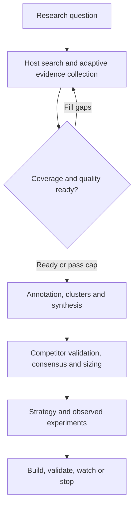

# Pain Intelligence Lab documentation

Use this page as the documentation map.

## Start here

### [5-minute Quick Start](QUICKSTART.md)

Use this if you want to get the platform running and complete your first manual, Reddit or autonomous research workflow quickly.

### [Complete User Guide](USER_GUIDE.md)

The primary end-user/operator manual. It covers:

- installation
- MongoDB and environment setup
- browser workspaces
- manual evidence collection
- autonomous research jobs
- Codex / Claude Code MCP setup
- search planning
- deep scraping
- coverage and quality gates
- semantic annotation
- semantic clustering
- opportunity synthesis
- competitor / pricing validation
- Reddit research
- scoring interpretation
- MCP tool map
- troubleshooting
- safety boundaries
- full end-to-end example

If you are unsure which document to read, read the User Guide.

## System reference and operations

| Guide | Use it for |
| --- | --- |
| [Architecture](ARCHITECTURE.md) | Understand runtime boundaries, module ownership, middleware order, job states and host processing diagrams |
| [Data model](DATA_MODEL.md) | Collections, entity relationships, identity, provenance, retention and deletion behavior |
| [HTTP API guide](API_REFERENCE.md) | Request contracts, examples, status codes, limits and workflows |
| [Complete route inventory](API_ROUTES.md) | Every implemented API/relay method and path, generated from handlers |
| [Complete MCP reference](MCP_REFERENCE.md) | All discovered tools and full nested input schemas |
| [Deployment and operations](DEPLOYMENT.md) | One-command Compose setup, native development, environment settings, health, backups and recovery |
| [Developer guide](DEVELOPMENT.md) | Extend the application, preserve invariants, run checks and regenerate references |

## Deeper technical guides

### [MCP Harness Integration](MCP.md)

How the local stdio MCP bridge connects the platform to Codex, Claude Code or another MCP-capable host.

Read this when you are configuring an MCP client or debugging host/tool connectivity.

### [Autonomous Research Jobs](AUTONOMOUS_RESEARCH.md)

How the durable research queue, leases, coverage loop, semantic-analysis stage and market-validation stage work.

Read this when you are changing or extending job orchestration.

### [Adaptive Scraping Intelligence](SCRAPING_INTELLIGENCE.md)

How the adaptive crawl frontier canonicalizes and ranks public URLs, applies source-specific traversal contracts, scores extraction quality, preserves provenance, respects access boundaries and stops when marginal evidence yield collapses.

Read this when you want the strongest public-web evidence collection workflow rather than simple search-result browsing.

### [Deep Research Workflow](DEEP_RESEARCH.md)

How search missions, search memory, entity branching, deep-scrape contracts, evidence independence, contradiction hunting and research-quality scoring work.

Read this when you are improving collection quality.

### [Host-powered LLM Intelligence](HOST_LLM.md)

Why the application does not need an OpenAI/Anthropic model API key and how the connected MCP host performs semantic annotation, JTBD/entity extraction, clustering and opportunity synthesis.

Read this when you are working on the semantic layer.

### [Research Quality Intelligence](QUALITY_INTELLIGENCE.md)

How the post-synthesis challenge layer adds cross-run pain lineage, explicit support-vs-contradiction classification, canonical competitor/entity memory, deterministic opportunity rescoring and sourced TAM/SAM/SOM ranges.

Read this when you want to improve decision quality after semantic synthesis instead of simply generating more opportunities.

### [Founder / Product Opportunity OS](OPPORTUNITY_OS.md)

How validated opportunities become durable execution workspaces with ICP/buyer strategy, founder-team fit, validation experiments, real-world outcome scoring, MVP specifications and first-customer GTM plans.

Read this when you want to move from "interesting opportunity" to an evidence-backed build/validate/watch/stop decision.

### [System Audit and Reliability](SYSTEM_AUDIT.md)

Correctness invariants introduced during the full reliability audit, including multi-job evidence membership, state guards, story-level independence and regression tests.

Read this before modifying research state, evidence ownership or destructive operations.

## Recommended reading paths

- **New user:** Quick Start → User Guide → the guide for your workspace.
- **Operator:** Deployment → Data model → System Audit.
- **MCP integrator:** MCP → MCP Reference → Autonomous Research → Deep Research → Scraping Intelligence.
- **Contributor:** Architecture → Data model → API guide → Developer guide → System Audit.

## Platform workflow

Detailed runtime, state, sequence and data relationship diagrams are in [Architecture](ARCHITECTURE.md) and [Data model](DATA_MODEL.md).

The platform itself does not require an OpenAI, Anthropic, embedding, scraping, or proxy API key. The connected MCP host supplies browsing and semantic reasoning from its own session.
